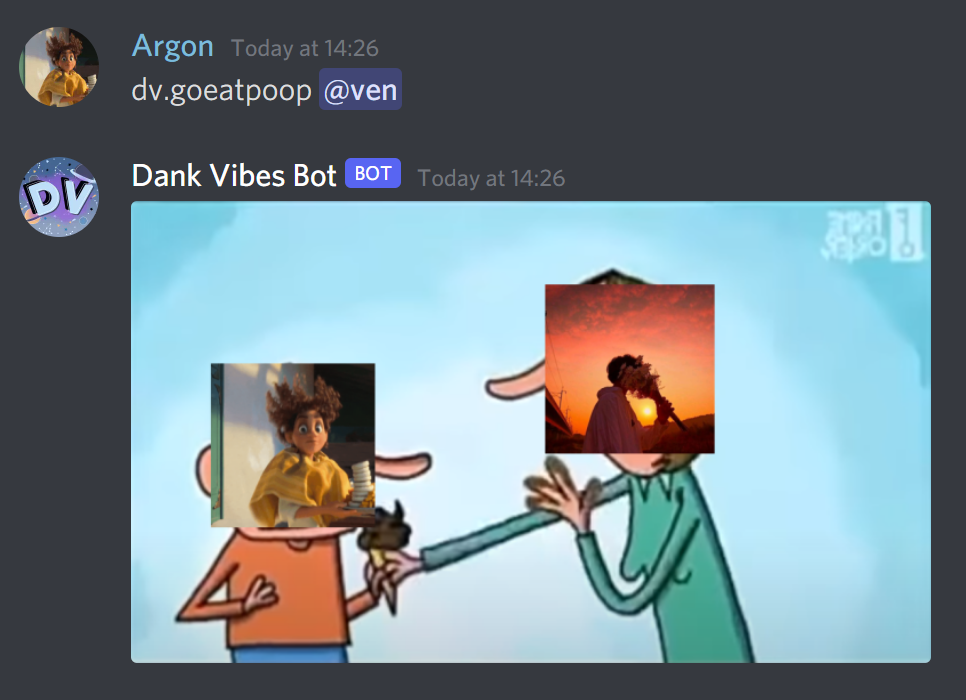
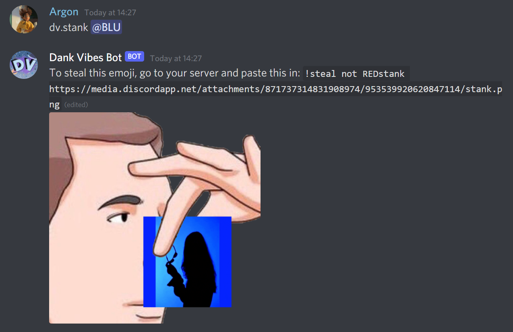
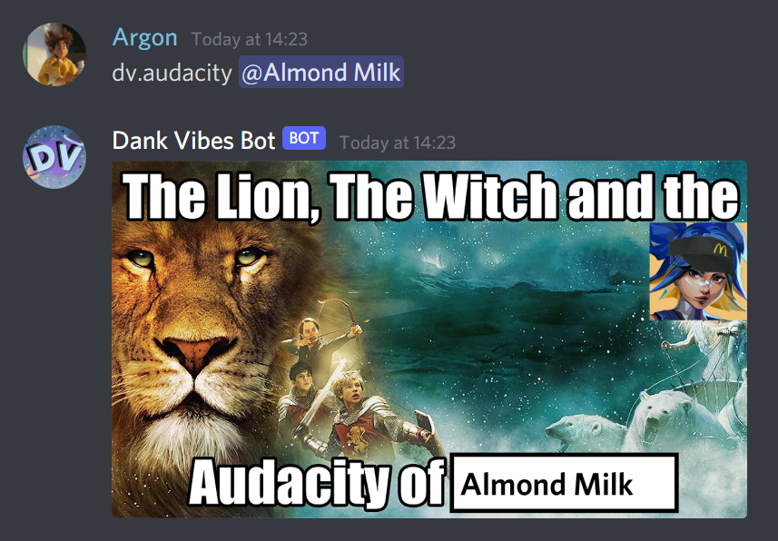
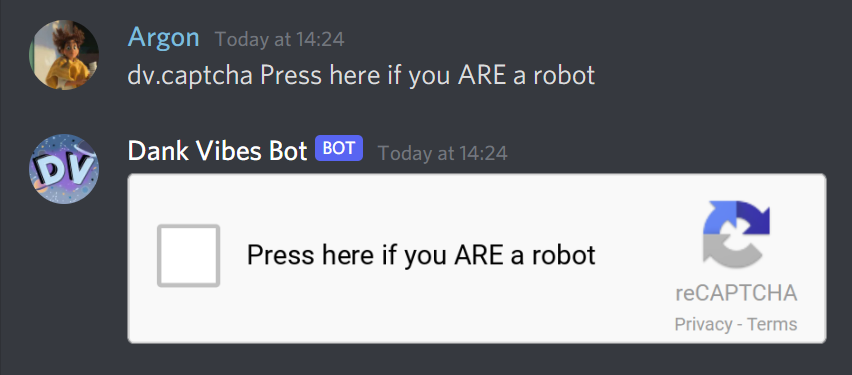
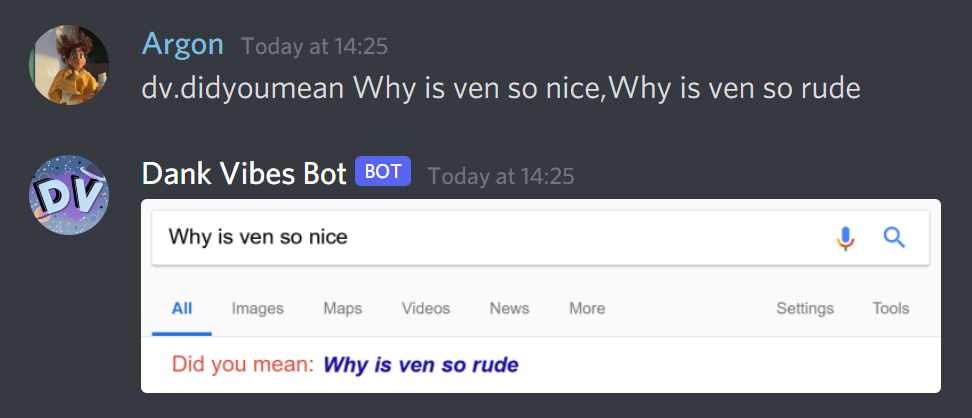
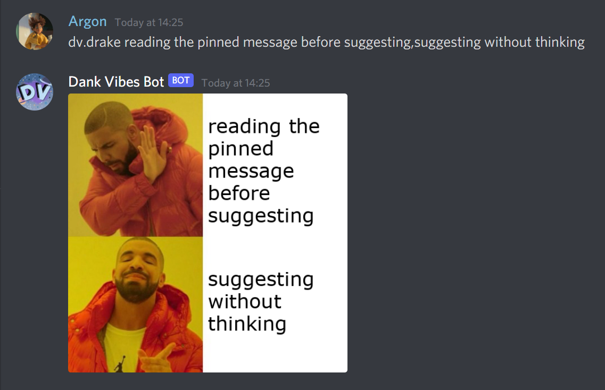
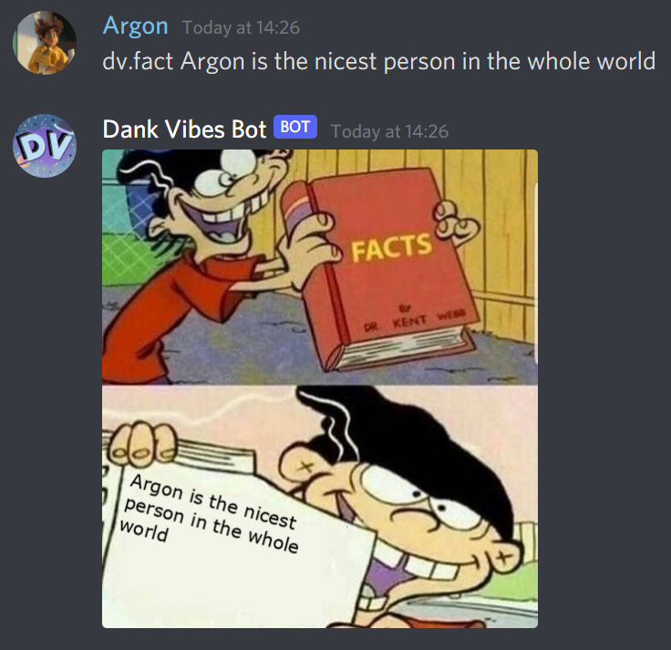
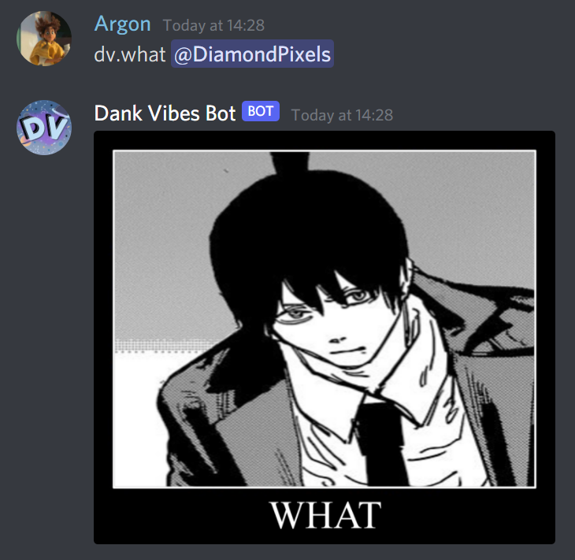

# Image Generation

Originally part of the [Fun](../commands/fun/fun.md) category.

Most, if not all of these prefixed commands also exist as [Slash commands](../slash_commands.md).

## `goeatpoop`

Get someone to eat poop

{ width="500" }

!!! tip "Usage"
    
    `goeatpoop [member]` 

    * `member`: The member who you want to eat poop

## `stank`

Someone's too stanky in here.

{ width="500" }

!!! tip "Usage"
    
    `stank [member]` 

    * `member`: The member who's stinky

## `audacity`

The Lion, The Witch, and the Audacity of-

{ width="500" }

!!! tip "Usage"
    
    `audacity [member]` 

    * `member`: The member who is being a b-

## `annoy`

Generate an image of someone being annoying in your DMs.

{ width="500" }

!!! tip "Usage"
    
    `annoy [member]` 

    * `member`: The member who is annoying you

## `captcha`

Generate a reCAPTCHA button with the specified text.

{ width="500" }

!!! tip "Usage"
    
    `captcha [text]` 

    * `text`: The text to show beside the recaptcha button.

## `didyoumean`

Google's Did You Mean can be really fuzzy sometimes.

{ width="500" }

!!! tip "Usage"
    
    `didyoumean [text]` 

    * `text`: The text to show. It should be two phrases separated by a `,`.

## `drake`

I don't really know how to explain this meme... It's just the drake hotline bling meme thing

{ width="500" }

!!! tip "Usage"
    
    `drake [member]` 

    * `text`: The text to show. It should be two phrases separated by a `,`.

## `fact`

IT IS A FACT!!!

{ width="500" }

!!! tip "Usage"
    
    `fact [text]` 

    * `text`: The text that is a fact.

## `bad`

you bad bad (but it's a man)

{ width="500" }

!!! tip "Usage"
    
    `bad [member]` 

    * `member`: the member who is misbehaving

## `what`

*sancturary guardian music plays*

{ width="500" }

!!! tip "Usage"

    `what [member]`

    * `member`: WHAT

## `spam`

Shows you images of spam (the food)

!!! tip "Usage"

    `spam`

## `spoiler`

Adds a fake spoiler tag to a photo that you sent, including blurring it.

{ width="500" }

!!! tip "Usage"

    `spoiler [argument]`
    * `argument`: Can be an: 
        * Attachment
        * Emoji (not recommended)
        * Image URL or
        * A user (to get their profile picture)