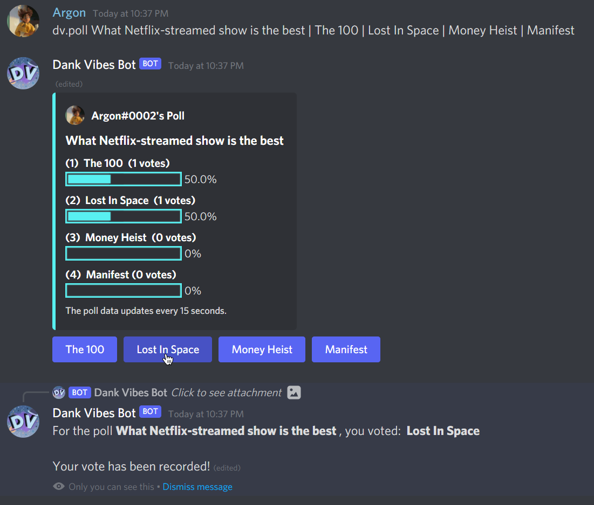

# Utility

In addition to utility commands, Dank Vibes Bot also adds and remove roles automatically from users participating in a Last to Leave VC.

## `nick`

Request a nickname.

!!! tip "Usage"

    `nick [nickname]`

    * `nickname`: The nickname that you want.

**Aliases**: `requestnick`, `setnick`

## `poll`

Creates an interactive poll.

{ width=700 }

!!! tip "Usage"

    `poll [question_and_choices]`

    The `question_and_choices` should be in this format:

    `question | option 1 | option 2 (optional) | option 3 (optional) | option4 (optional) | option5 (optional)`

    There can only be a 'maximum of 5 options, and none of them can be similar.

    The options can be separated by a pipe (`|`) or a comma (`,`).

    Example: If I wanted to ask if Almond was sussy or Minty was, I would use:

    > `dv.poll Who is sussy? | Almond | Minty`

    This will result in a poll with the question "Who is sussy?" and "Almond" and "Minty" as the options.

    A question can only have a maximum of 100 characters.

    An option can only have a maximum of 30 characters.

## `remind`

Reminds you of something after a certain amount of time. 

!!! tip "Usage"

    `remind [duration] [what_to_remind]`

    * `duration`: Any direct date or a human readable duration. Examples:

        * `next thursday at 3pm`
        * `2d`
        * `in 3 days`
    * `what_to_remind`: The thing you want to be reminded of.

**Aliases**: `reminder`, `remindme`, `rm`

## `remind list`

Lists all of your reminders.

!!! tip "Usage"

    `remind list`

**Aliases**: `mine`, `show`, `display`

## `remind delete`

Deletes a reminder.

!!! tip "Usage"
    
    `remind delete [reminder_id]`

    * `reminder_id`: The ID of the reminder you want to delete.

**Aliases**: `remove`, `del`, `rm`

## `remind clear`

Completely clears your reminder list.

!!! danger

    This action cannot be reversed! 

!!! tip "Usage"

    `remind clear`

    **Aliases**: `clean`, `purge`, `reset`

## `remind when`

Shows you details about a reminder and when it ends.

!!! tip "Usage"

    `remind when [reminder_id]`

    * `reminder_id`: The ID of the reminder you want to check.

**Aliases**: `when`, `details`

## `remind repeat`

Repeats/loops a reminder, making it reoccuring with a set interval

If no interval is provided, the reminder will repeat based on its original duration.

To stop a reminder from repeating, use `remind repeat [id] -1`. 

!!! tip "Usage"

    `remind repeat [reminder_id] <interval>`

    * `reminder_id` The ID of the reminder you want it to repeat.
    * `interval` The interval at which you'll be reminded about the specified reminder again. Enter `-1` if you want the reminder to stop repeating.

**Aliases**: `loop`

## `remind subscribe`

Copy another person's reminder and make it your own!

!!! tip "Usage"
    
    `remind subscribe [reminder_id]`

    * `reminder_id`: The ID of the reminder you want to copy.

**Aliases**: `sub`, `clone`

## `remind import`

Import your reminders from Carl-bot.

!!! tip "Usage"

    `remind import`

    Dank Vibes Bot will then bring you through an interactive and easy setup to move your highlight settings from Carl-bot to Dank Vibes Bot.

## `suggest`

Suggest a feature for Dank Vibes Bot.

!!! tip "Usage"

    `suggest [feature]`

    * `feature`: The feature you want to suggest.

## `teleport` 

Teleport to a channel via a saved checkpoint.

!!! tip "Usage"
    
    `teleport [checkpoint]`

* `checkpoint`: The checkpoint for the channel.

**Aliases**: `tp`

## `teleport add`

Adds a channel checkpoint.

!!! tip "Usage"

    `teleport add [checkpoint] [channel]`

    * `checkpoint`: The checkpoint (name) for the channel.
    * `channel`: The channel to associate with the checkpoint.

## `teleport remove`

Removes a channel checkpoint.

!!! tip "Usage"

    `teleport remove [checkpoint]`

    * `checkpoint`: The checkpoint (name).

## `teleport list`

Shows all checkpoints and their associated channels.

!!! tip "Usage"

    `teleport list`

## `teleport clear`

Removes all checkpoints.

!!! danger

    This action cannot be reversed!

!!! tip "Usage"

    `teleport clear`

**Aliases**: `clear`

## `translate`

Translate text up to 1000 characters.

By default, the text's language is auto-detected then translated into English.

You can specify a language for the text to be translated into.

Examples:

* `dv.translate 永远不会放弃你` will detect the text as Chinese and translate it into English.
* `dv.translate hi 永远不会放弃你` will detect the text as Chinese, then translate it into Hindi, returning the result.

A list of languages available is shown in [`translate languages`](#translate-languages).

!!! tip "Usage"

    `translate <language> [text]`

    * `language`: The language to translate the text into, not required.
    * `text`: The text to translate.

**Aliases**: `trans`, `tl`

## `translate languages`

List all languages that text can be translated into via [translate](#translate).

!!! tip "Usage"

    `translate languages`

**Aliases**: `langs`, `lang

## `uptime`

Shows Dank Vibes Bot's uptime.

!!! tip "Usage"

    `uptime`

## `ping`

Shows Dank Vibes Bot's ping and latency.

!!! tip "Usage"

    `ping`

## `prefix`

Change Dank Vibes Bot's prefix for the server.

!!! tip "Usage"

    `prefix [prefix]`

    * `prefix`: The new prefix.

## `info`

Shows Dank Vibes Bot's information.

!!! tip "Usage"

    `info`

## `checkpvc`

Check the owner and the members of a private channel (ticket).

!!! tip "Usage"

    `checkpvc <channel>`

    * `channel`: The channel to check. This is only for moderators. For the public, you can only run this in your own private channel.

**Aliases**: `pvc`, `privchannel`

## `mymessages`

Shows the number of messages a user has sent in #general-chat. Mainly used for giveaway requirements.

!!! tip "Usage"

    `mymessages [member]`

    * `member`: The member to check.

**Aliases**: `messagecount`, `mym`

## `cooldowns`

Shows your active command cooldowns in Dank Vibes Bot.

!!! tip "Usage"

    `cooldowns`

**Aliases**: `mycooldowns`, `cds`, `mycds`, `cd`

## `invite`

Invite Dank Vibes Bot to the server!

!!! tip "Usage"

    `invite`

## `timer`

Start a timer to be shown in a message! You can include a title for the timer,a nd a channel for the timer to be sent to.

!!! tip "Usage"

    `timer <channel> [duration] <title>`

    * `channel`: The channel to send the timer to.
    * `duration`: The duration of the timer in seconds.
    * `title`: The title of the timer.

## `avatar`

Shows you or a user's avatar, banner or server banner.

!!! tip "Usage"

    `avatar [user]`

    * `user`: The user to show the avatar of.

**Aliases**: `av`, `pfp`, `banner`, `bn`, `sav`

## `whois`

Get information about a user.

!!! tip "Usage"

    `whois [user]`