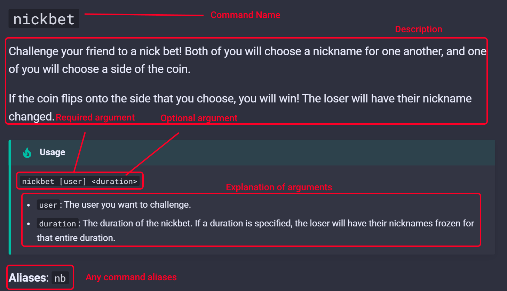

# Home

* [Commands](commands/fun/fun)
* [Slash commands](slash_commands)
* [Other Features](others)
* [About Dank Vibes Bot](about)

!!! Tip "How to read"
    
    The syntax is very easy to read.
    
    `[]` denotes compulsory/required arguments in a command, whereas `<>` denotes optional arguments.
    

Join Dank Vibes to exprience the bot in all its entirety!

Dank Vibes Bot **cannot** be invited to another server.

[Join Dank Vibes!](https://discord.gg/dankmemer){ .md-button .md-button--primary}